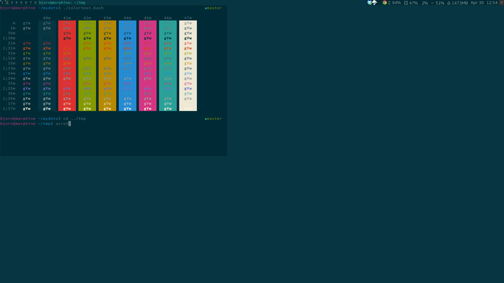
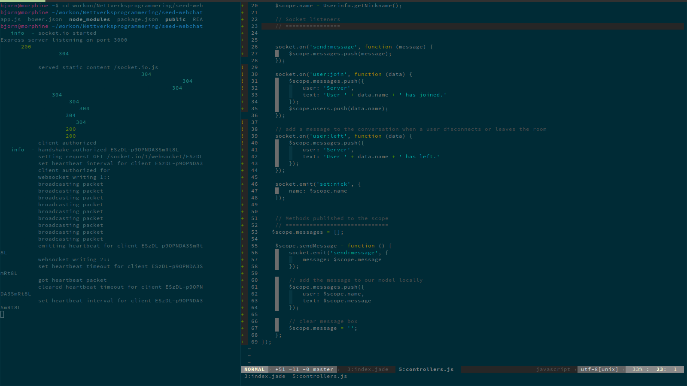
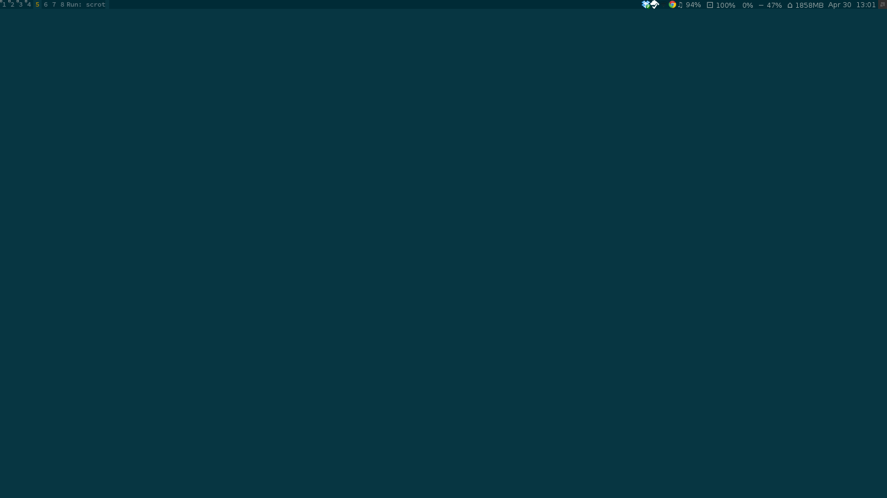

MyAwesomeWM Dark Solarized
============
This is a theme for the [Awesome Window Manager](http://awesome.naquadah.org/).

## Dependencies
- [Awesome 3.5](http://awesome.naquadah.org/download/)
- [Vicious](http://git.sysphere.org/vicious/). I have included a snapshot vicious installation that I know works with this theme. Upgrade at your own risk.
- alsamixer
- htop
- urxvt

## Shortcuts
* `ModKey + Q` Launch google-chrome-stable.
* `ModKey + i` Launch ranger.

* `Modkey + [1-8]` Switch desktop.
* `Modkey + Shift + [1-8]` Move application to desktop.

* `Modkey + F12` Start/pause awmodoro.
* `Modkey + Shift + F12` Stop awmodoro.
## Screenshots

